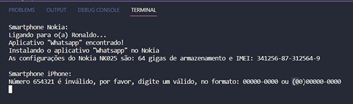

# DIO - Trilha .NET - Programação orientada a objetos
www.dio.me

## Desafio de projeto
Para este desafio, você precisará usar seus conhecimentos adquiridos no módulo de orientação a objetos, da trilha .NET da DIO.

## Contexto
Você é responsável por modelar um sistema que trabalha com celulares. Para isso, foi solicitado que você faça uma abstração de um celular e disponibilize maneiras de diferentes marcas e modelos terem seu próprio comportamento, possibilitando um maior reuso de código e usando a orientação a objetos.

## Proposta
Você precisa criar um sistema em .NET, do tipo console, mapeando uma classe abstrata e classes específicas para dois tipos de celulares: Nokia e iPhone. 
Você deve criar as suas classes de acordo com o diagrama abaixo:

## Regras e validações
1. A classe **Smartphone** deve ser abstrata, não permitindo instanciar e servindo apenas como modelo.
2. A classe **Nokia** e **Iphone** devem ser classes filhas de Smartphone.
3. O método **InstalarAplicativo** deve ser sobrescrito na classe Nokia e iPhone, pois ambos possuem diferentes maneiras de instalar um aplicativo.

## Solução Indicada
O código está pela metade, e você deverá dar continuidade obedecendo as regras descritas acima, para que no final, tenhamos um programa funcional. Procure pela palavra comentada "TODO" no código, em seguida, implemente conforme as regras acima.

## Diagrama Final

## Solução
Foi criado a interface ILoja, ela possui a assinatura do método VerificarAplicativo, assim, a classe que implementar ela, deve implementar também este método. Por reutilização de código, a classe abstrata Smartphone a implementou, seus filhos são a classe Nokia e Iphone. A classe abstrata também interage com a classe estática TorreTelefonia.

### Classe abstrata Smartphone
Essa classe têm essas propriedades:
 - Numero (string): Representa o número do celular, no seu construtor é realizado uma validação, podendo conter ou não o DDD.
 - Modelo (string): Representa o modelo do celular.
 - IMEI (string): Representa o IMEI do celular, também no construtor é realizado uma validação.
 - Memória (int): Refere-se ao armazenamento do aparelho.
 - SinalDeRede (bool): Obtem seu valor do método estático VerificarSinal, da classe estática TorreTelefonia, essa propriedade diz se está com sinal de rede, para realizar e receber ligações e utilizar o 3G.

Seus métodos são:
 - void VerificarAplicativo(string aplicativo): Caso tenha sinal, exibe um texto que encontrou o aplicativo, se não estiver com sinal, exibe um texto que não encontrou o aplicativo.
 - string Ligar(): Existe a sobrecarga Ligar(string pessoa), em ambos os casos, exibe uma mensagem que se está ligando ou ligando para alguém, isso caso se tenha sinal.
 - void ReceberLigacao(): Se estiver com sinal, exibe o texto que está recebendo uma ligação.
 - void InstalarAplicativo(string nomeApp) <<abstract>>: Método abstrato que deve ser implementado pela classe filha.
 - void ExibirConfiguracoes(): Método abstrato que deve ser implementado pela classe filha.

### Classe estática TorreTelefonia
Essa classe não pode ser implementada e também não pode ter construtores, além disso, todos os seus membros precisam ser estáticos.
Ela possuí o atributo TemSinal (bool), esse atributo mostra se através da torre será possível um celular se conectar a rede telefônica.

Seus membros são:
 - bool VerificarSinal(): Retorna o atributo TemSinal.
 - void AlternarSinal(): Altera o valor do atributo TemSinal.

### Classe Nokia e Iphone
Essas classes são filhas da Smartphone, elas possuem dois métodos novos, sendo eles:
 - void ExibirConfiguracoes() <<sealed>>: Mostra um texto com as principais informações do celular, como sua memória e seu IMEI. Por ser selada, seus filhos não podem sobrescrever esse método.
 - void InstalarAplicativo(string nomeApp): Caso o aplicativo seja encontrado, exibirá uma mensagem que ele foi instalado.

## Vídeo
Caso tenha interesse, pode assistir um vídeo sobre o projeto clicando na imagem ou link

Link: https://youtu.be/zehGcGLgW0Y

## Agradecimentos
Agradeço muito  à **Digital Innovation One** e **Pottencial** pela oportunidade, também sou muito grato ao professor **Leonardo Buta**, que está ministrando as aulas de C# desse bootcamp, com uma excelente didática!!